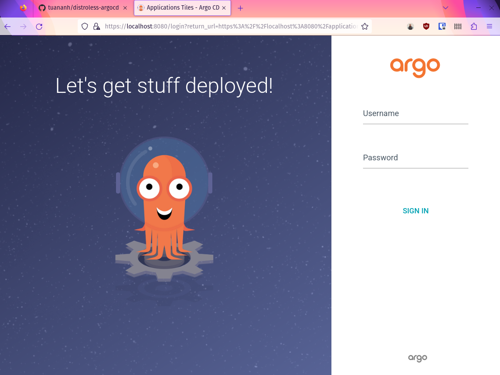

[](https://github.com/tuananh/apko-image-template/actions/workflows/release.yaml)

## What is this?

This is a POC to build Argo CD container image with melange & apko.

## How I test it?

Create a local KIND cluster with

```sh
kind create cluster --name argocd-demo
```

Build the local image locally and load into docker + kind cluster

```
docker load < distroless-argocd.tar
kind load docker-image distroless-argocd:latest --name argocd-demo
```

Install latest Argo-CD Helm chart (5.24.0 as of this post) with only change is the image

```yaml
global:
  image:
    repository: distroless-argocd
    tag: "latest"
```

And everything is working as it supposes.



## What's next

Let's open an issue in ArgoCD to see if they would accept an PR to build official ArgoCD image with melange & apko.

